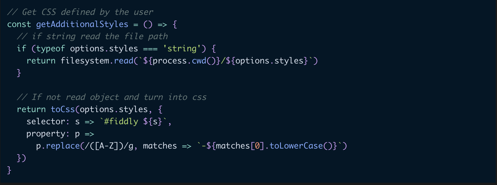
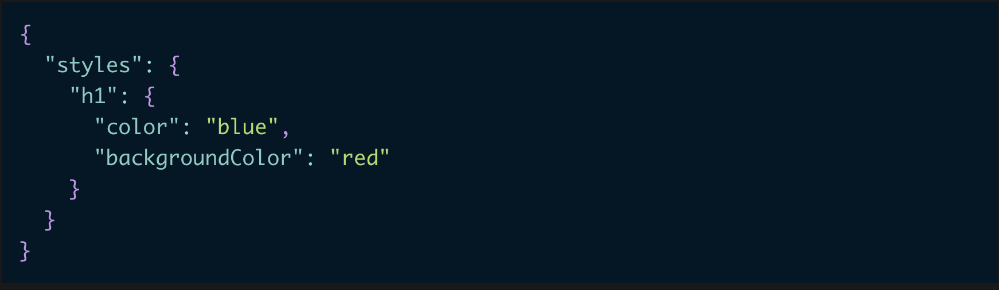

# [prism-theme-night-owl](https://prism-theme-night-owl.netlify.com/)

A port of the popular VSCode theme [Night Owl](https://github.com/sdras/night-owl-vscode-theme) by [Sarah Drasner](https://github.com/sdras/) to prism.

## Example shots

### JS



### JSON


### CSS



## Install

`npm install --save prism-theme-night-owl`

## Usage

```js
import "prism-theme-night-owl";
```

or

```html
<link
  href="https://unpkg.com/prism-theme-night-owl@1.4.0/build/style.css"
  rel="stylesheet"
/>
```

### No italics version

```js
import "prism-theme-night-owl/build/no-italics.css";
```

```html
<link
  href="https://unpkg.com/prism-theme-night-owl@1.4.0/build/no-italics.css"
  rel="stylesheet"
/>
```

### Light version

```js
import "prism-theme-night-owl/build/light.css";
```

```html
<link
  href="https://unpkg.com/prism-theme-night-owl@1.4.0/build/light.css"
  rel="stylesheet"
/>
```

### Light no italics version

```js
import "prism-theme-night-owl/build/light-no-italics.css";
```

```html
<link
  href="https://unpkg.com/prism-theme-night-owl@1.4.0/build/light-no-italics.css"
  rel="stylesheet"
/>
```

MIT License, see the included [License.md](License.md) file.
